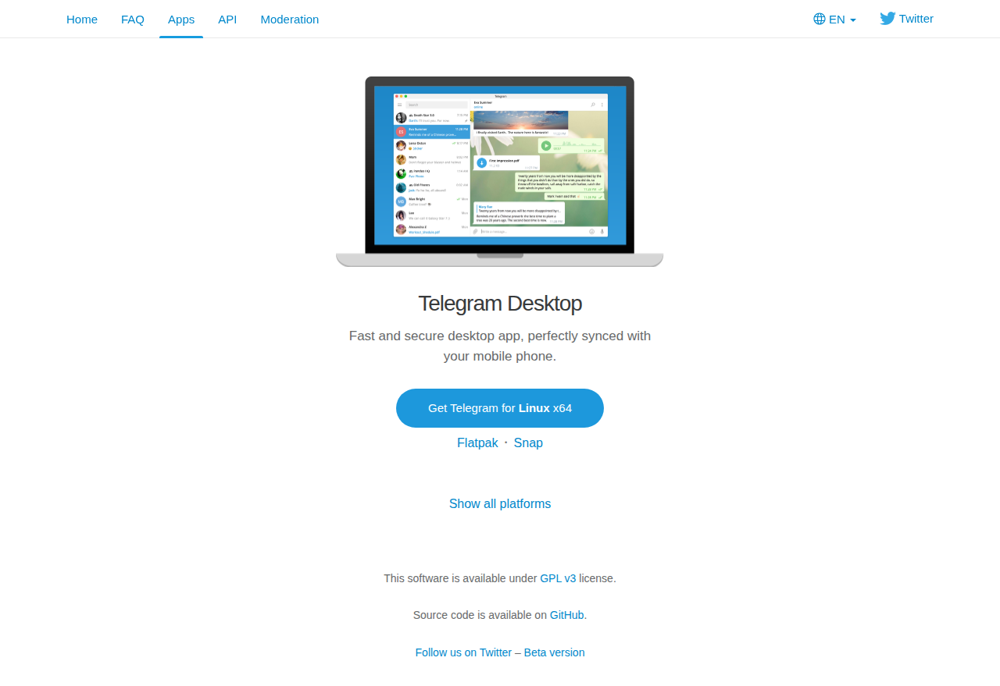

# Visited: https://telegram.org/dl
**Time:** Sun May  3 08:48:47 UTC 2026

## Screenshot

## Raw HTML
[page.html](./page.html)

## Downloaded Media (0 files)
_No media files downloaded_

## Other Links
- [#](#)
- [#bug-bounty-program](#bug-bounty-program)
- [#desktop-apps](#desktop-apps)
- [#madelineproto-unofficial](#madelineproto-unofficial)
- [#mobile-apps](#mobile-apps)
- [#source-code](#source-code)
- [#telegram-cli-unofficial](#telegram-cli-unofficial)
- [#telegram-database-library](#telegram-database-library)
- [#telegram-database-library-tdlib](#telegram-database-library-tdlib)
- [#telegram-desktop](#telegram-desktop)
- [#telegram-for-android](#telegram-for-android)
- [#telegram-for-ios](#telegram-for-ios)
- [#telegram-for-macos](#telegram-for-macos)
- [#telegram-for-web-browsers](#telegram-for-web-browsers)
- [#telegram-for-wp](#telegram-for-wp)
- [#telegram-react](#telegram-react)
- [#telegram-x-for-android](#telegram-x-for-android)
- [#unigram-unofficial](#unigram-unofficial)
- [#unofficial-apps](#unofficial-apps)
- [#web-apps](#web-apps)
- [/](/)
- [//core.telegram.org/](//core.telegram.org/)
- [//core.telegram.org/api](//core.telegram.org/api)
- [//desktop.telegram.org/](//desktop.telegram.org/)
- [//instantview.telegram.org/](//instantview.telegram.org/)
- [//macos.telegram.org/](//macos.telegram.org/)
- [//translations.telegram.org/](//translations.telegram.org/)
- [/android](/android)
- [/apps](/apps)
- [/apps#desktop-apps](/apps#desktop-apps)
- [/apps#mobile-apps](/apps#mobile-apps)
- [/blog](/blog)
- [/css/bootstrap.min.css?3](/css/bootstrap.min.css?3)
- [/css/telegram.css?249](/css/telegram.css?249)
- [/dl/ios](/dl/ios)
- [/dl/web](/dl/web)
- [/faq](/faq)
- [/file/464001916/10d69/wMJtQWE_ZwI.17701.png/f4e97997cb38fc577a](/file/464001916/10d69/wMJtQWE_ZwI.17701.png/f4e97997cb38fc577a)
- [/img/website_icon.svg?4](/img/website_icon.svg?4)
- [/js/main.js?47](/js/main.js?47)
- [/js/tgsticker.js?31](/js/tgsticker.js?31)
- [/moderation](/moderation)
- [/press](/press)
- [/privacy](/privacy)
- [?setln=ar](?setln=ar)
- [?setln=be](?setln=be)
- [?setln=de](?setln=de)
- [?setln=en](?setln=en)
- [?setln=es](?setln=es)
- [?setln=fa](?setln=fa)

## Stats
- Links: 105
- Media: 0
